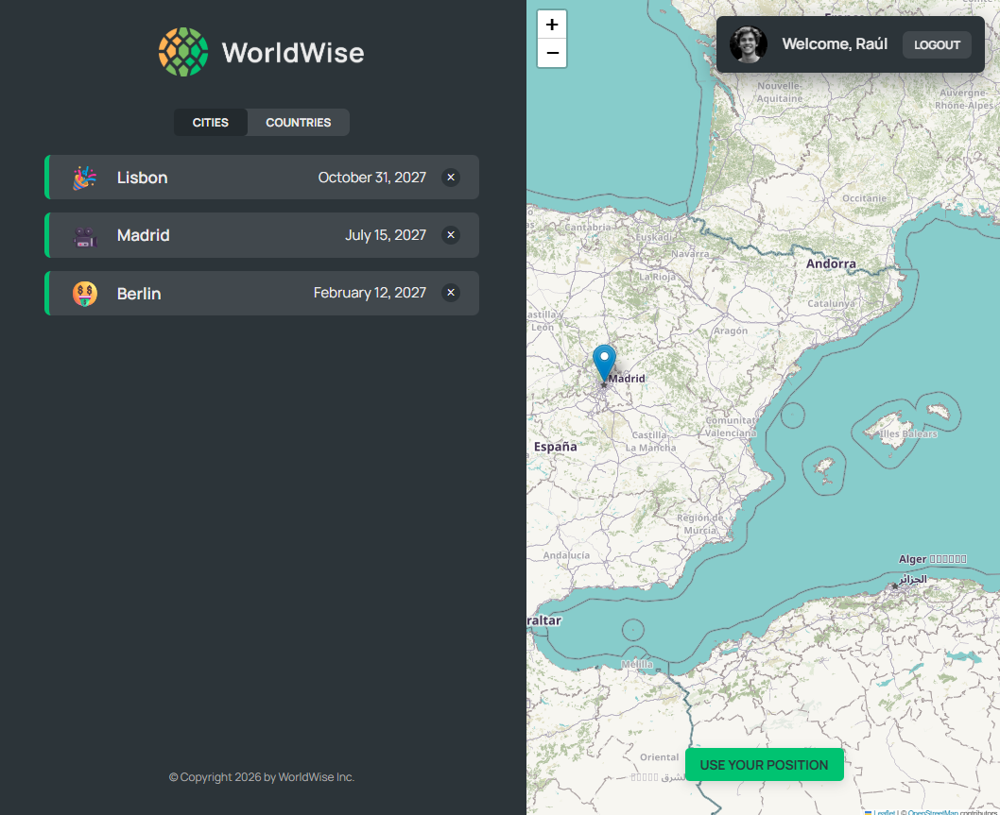
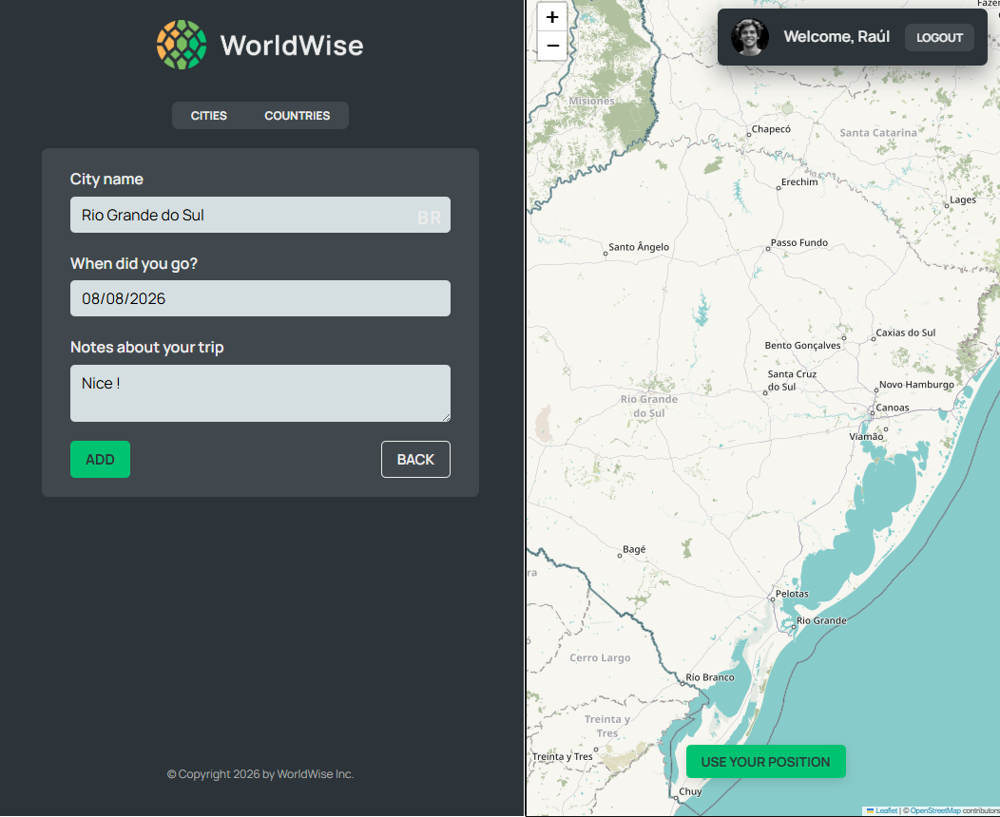

# 📍 WorldWise

A modern travel tracking application built with **React**, **TypeScript**, **Context API**, and **useReducer**, following a feature-based architecture inspired by enterprise applications.

## Preview






## Features

- React 19
- TypeScript
- Context API
- useReducer for state management
- React Router
- Feature-based architecture
- Authentication
- Protected routes
- Interactive maps with React Leaflet
- Browser Geolocation API
- Reverse Geocoding
- Reusable UI components
- Custom hooks
- Service layer
- Strongly typed reducers and actions
- Loading and error boundaries
- CSS Modules

## Demo

The project is deployed on Firebase Hosting.

> **Note**
>
> This project uses **json-server** as a local REST API.
> Because the backend is not deployed, creating, updating or deleting cities is not available in the online demo.
>
> To experience the complete application locally, follow the installation steps below.

## Getting Started

### Install dependencies

```bash
npm install
```

### Start the mock API

```bash
npm run server
```

### Start the application

```bash
npm run dev
```

## Project Structure

```text
src/

features/
│
├── auth/
│   ├── components/
│   ├── context/
│   ├── reducers/
│   ├── hooks/
│   └── services/
│
├── cities/
│   ├── components/
│   ├── context/
│   ├── reducers/
│   ├── hooks/
│   ├── pages/
│   └── services/
│
├── countries/
│
shared/
│
├── components/
├── hooks/
└── utils/
│
layouts/
│
└── AppLayout/
```

## Architecture

Instead of following the original JavaScript project structure, this application was redesigned using a **feature-first architecture**.

Each feature owns its own:

- Components
- Pages
- Context
- Reducer
- Hooks
- Services
- Domain types

This organization keeps business logic isolated, improves scalability, and makes features easier to maintain.

Shared resources such as reusable components, hooks, and utilities are located under the `shared` folder, while layout-specific components live inside the `layouts` module.

## State Management

The application uses:

- Context API
- useReducer
- Strongly typed reducer actions
- Typed Context Providers
- Custom hooks for state consumption

This combination provides a lightweight alternative to external state management libraries while keeping business logic centralized.

## Technologies

- React 19
- TypeScript
- React Router
- React Leaflet
- Context API
- useReducer
- Vite
- CSS Modules
- json-server

## Learning Goals

During this refactoring I focused on:

- Feature-oriented architecture
- Context API
- useReducer
- Separation of concerns
- Strong typing with TypeScript
- Custom hooks
- Route protection
- Reusable components
- Enterprise project organization

## Acknowledgements

This project started as part of **Jonas Schmedtmann's React course**.

Rather than keeping the original JavaScript implementation, I redesigned the application using a scalable architecture inspired by enterprise React applications while preserving the original functionality.

The main goals of this refactoring were to practice clean architecture, improve maintainability, and reinforce TypeScript best practices.
